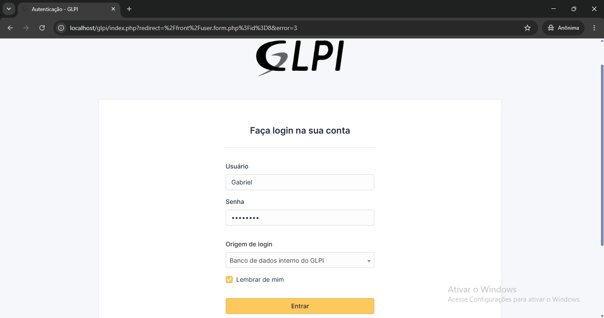

<h1 align="center">💻 Central de Serviços GLPI</h1>

<p align="center">
   Projeto de Service Desk com GLPI para gerenciamento de chamados e inventário de TI.
</p>

<p align="center">
    <a href="#-sobre-o-projeto">Sobre</a> •
    <a href="#-tecnologias">Tecnologias</a> •
    <a href="#-instruções-de-uso"> Instruções de Uso</a> •
    <a href="#-autor"> 👨‍💻 Autor</a>
</p>

<p align="center">
    <a href="http://localhost/glpi/">
        🚀 Acessar Ambiente Local
    </a>
</p>

<p align="center">


</p>

## 📖 Sobre o Projeto

Este projeto simula um ambiente corporativo de **Service Desk** utilizando o **GLPI**, permitindo demonstrar todas as etapas do ciclo de atendimento de um chamado, desde sua abertura pelo usuário até sua resolução pelo analista de suporte.

## 💻 Tecnologias

- **GLPI 10.x** – Gerenciamento de chamados e ativos de TI.
- **PHP** – Linguagem da aplicação.
- **Apache** – Servidor Web.
- **MariaDB / MySQL** – Banco de Dados.

---

## 🚀 Instruções de Uso 

Siga as etapas abaixo para acessar o laboratório e simular o fluxo completo de suporte:

### 1. Acesso ao Sistema
Abra o seu navegador anônimo e acesse:
> [http://localhost/glpi/front/central.php](http://localhost/glpi/front/central.php)

### 2. Autenticação de Teste
Utilize as credenciais homologadas abaixo para validar os diferentes níveis de permissão (perfis de acesso):

| Perfil | Usuário | Senha |
| :--- | :--- | :--- |
| **Usuário (Login) ** | `Gabriel` | `Sd112406` |
| **Analista Técnico (Suporte)** | `Samuel` | `Sd112406` |

---

# 📋 Fluxo de Atendimento

## 1. Login como Usuário

- Faça login utilizando o usuário **Gabriel**.

<p align="center">
    
</p>

## 2. Abertura do Chamado
- Clique em **Criar um chamado**
- Selecione uma categoria
- Informe a descrição do problema
- Envie o chamado

<p align="center">
      
</p>

## 3. Login como Analista

Desconecte o usuário e faça login utilizando:

```
Usuário: Samuel
Senha: Sd112406
```

<p align="center">
    
</p>

## 4. Recebimento do Chamado

Acesse: 

- Assistência > Chamados
- Visualize todos os chamados pendentes e selecione o ticket criado anteriormente.

<p align="center">
    
</p>
---

---

### 5. Resolução Técnica 

Durante o atendimento o analista deverá:

1. Assumir o chamado
2. Alterar o status para **Em Atendimento**
3. Registrar o diagnóstico
4. Inserir a solução aplicada
5. Atualizar o histórico do ticket

## 6. Encerramento

Após concluir o atendimento:

1. Altere o status para **Solucionado**
2. Feche o chamado
3. Valide o histórico de atendimento

---

<h2 id="colab">🤝 Collaborators</h2>

<table>
  <tr>
    <td align="center">
      <a href="#">
        <br>
        <sub>
          <b>Samuel Izidoro</b>
        </sub>
      </a>
    </td>
  </tr>
</table>
